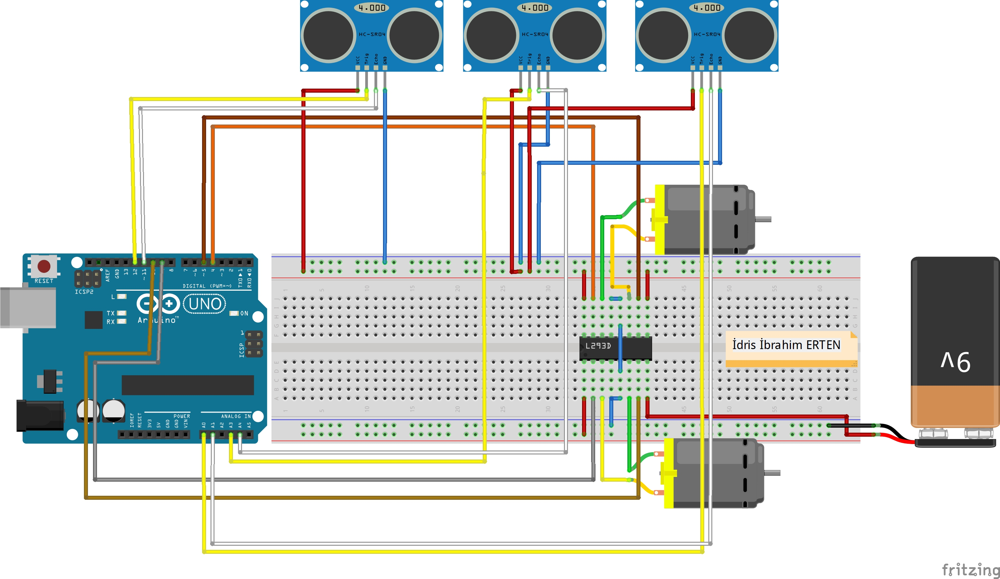

# Robot Project Avoiding Obstacle Using 3 Distance Sensors With Arduino Development Board

## Project Goals

  * Developing a robot that can avoid obstacles and solve mazes with 3 different distance sensors (HC-SR04 Ultrasonic sensor).
  
### Steps to Do

  * [Arduino IDE](https://www.arduino.cc/) &#8594; Do the installation on your computer.  
  * [Project Circuit Drawing](https://github.com/idrisibrahimerten/Arduino_Projects/tree/main/1%20-%203_sens%C3%B6rl%C3%BC_engelden_kacan_robot_projesi/circuit_drawing) &#8594; Make it complete by following the project drawing.

### Project Bill of Materials
  #### MATERIALS:

    * ARDUINO UNO

    * 2X 6V Geared DC motor + Wheel

    * L293D Motor Driver

    * 3x Hc-Sr04 Ultrasonic Distance Sensor

    * Drunk Wheel

    * Medium Breadboard

    * 9V battery + Battery cap

    * A suitable chassis for our robot depending on your preferences
    
 ### Project Circuit Drawing
 
#### To Turkish

# Arduino Geliştirme Kartı İle 3 Mesafe Sensörü Kullanarak Engelden Kaçan Labirent Çözen Robot Projesi

## Proje Hedefleri

  * 3 ayrı mesafe sensörü (HC-SR04 Ultrasonik sensör) ile engelden kaçan ve labirent çözebilen robot geliştirmek.
  
### Yapılması Gereken Adımlar

  * [Arduino IDE](https://www.arduino.cc/) &#8594; Kurulumunu bilgisayarınıza yapınız.  
  * [Proje Devre Çizimi](https://github.com/idrisibrahimerten/Arduino_Projects/tree/main/1%20-%203_sens%C3%B6rl%C3%BC_engelden_kacan_robot_projesi/devre_cizimi) &#8594; Proje çiziminden takibini yaparak eksiksiz yapınız.

### Proje Malzeme Listesi
  #### MALZEMELER:

    *  ARDUİNO UNO

    *  2X 6V Redüktörlü DC motor + Tekerlek

    *  L293D Motor Sürücü

    *  3x Hc-Sr04 Ultrasonik Mesafe Sensörü

    *  Sarhoş Tekerlek

    *  Ortaboy Breadbord

    *  9V pil + Pil başlığı

    *  Robotumuz için tercihlerinize bağlı olarak uygun bir şase
